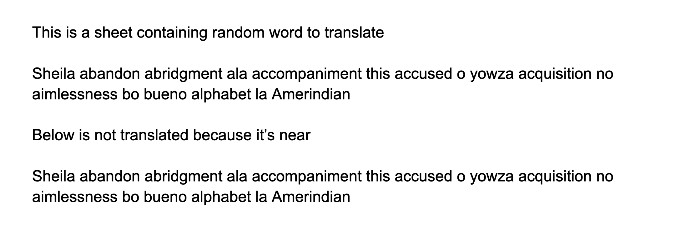
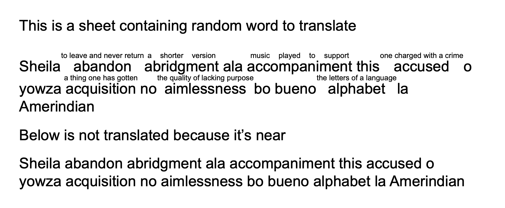

# wordwisecreator

Clone https://github.com/xnohat/wordwisecreator in go because I can't make modifications to php code.

May not be very useful for folks who doesn't know how to install stuff on local machines, i.e only for developers now ( I'm sorry 🥲 )

# requirements to build from source

- golang
- make
- calibre installed on your device, such that command `convert-ebook` is available

```
make
file=/path/to/some/file
./convert --in "$file" --hint 3 --of epub
```

to customize your own word blob, modify **[wordwise-dict.csv](wordwise-dict.csv)** then run make again

# demo

origin


result

# mo's draft plz ignore me

```
./convert --in <file> [--hint <1-5> --max-distance <1000> --parallel <8> --of <epub,pdf,azw3>] --od <output/directory/default/to/wordwise/in/file/folder>

dir=some/dir
while read -r f ; do ./convert --in "$f" --hint 3 --of epub ; done < <(find $dir -type f \( -iname \*.mobi -o -iname \*.epub \) )

```
